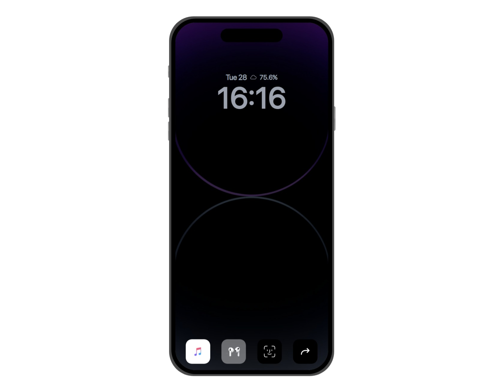

This is a solution to the [Coffee Room FE Competion 1.0] (https://www.figma.com/design/XRLYu4quqPq1kAoCVm0w7C/Cofee-Room-FE-Competition-1.0?node-id=7-616&t=MH6EqvXOeB95hdRS-0)

## Table of contents

- [Overview](#overview)
  - [The challenge](#the-challenge)
  - [Screenshot](#screenshot)
  - [Links](#links)
- [My process](#my-process)
  - [Built with](#built-with)
  - [What I learned](#what-i-learned)
  - [Continued development](#continued-development)
- [Author](#author)
- [Acknowledgments](#acknowledgments)

## Overview

### The challenge

The challemge focuses on creating one of the 5 iPhone 14 Dynamic Island Aniamtions included in the figma. 

- Call Animation
- Music Animation
- Navigation Animation
- FaceId Animation
- Airpods Animation

I tried to my possible best to recreate solutions for all animations but the call animation as time wasn't on my side.

Users/Viewers should be able to...
- Click on each navigation icon to launch the respective animations
- Click on the respective animations to  toggle expanded form of the animations

### Screenshot

### Links

- Solution URL: [Here is a link to my solution's GitHub Repository](https://github.com/jesutobiDev/dynamic-island-animations)
- Live Site URL: [Here is a link to the live site hosted on Vercel](https://dynamic-island-animations.vercel.app/)

## My process

1) Started by Creating the phone frame using jsx elements and tailwind css styling. I hardcoded a lot of styles as it is necessary for the designs to look as close as possible to the real instances, therefore, I advice you view this on a desktop device while zooming out using (Ctrl and - ) to prevent scrolling.

2) Then I went ahead to create the various components like the volume and power buttons. 
3) The the phone screen was created by using absolute positioning. 
4) After creating each of the components, I created the aniamtions and their vatious states designs
5) Then used GSAP for animations  to make the transitions a little smoother.

NB: Use the Icons at the bottom of the frame as triggers to display the animations 

### Built with

- Tailwind CSS
- Flexbox
- [React] - JS library
- [GSAP] - Animation Library

### What I learned

The major things I learned here was the use of GSAP, this is my very first use of the animation library. With the help of documentation and a little bit of ChatGPT, I pulled off something okay. 

### Continued development
Following this project, I would like to add to my learning curve the following as they would have helped me create a better solutution.
1) Redux 
2) GSAP or Framer Motion

In the future, I hope to complete this project by completing the call animations and making the animations more fluid.

## Acknowledgments
I'd like to appreciate The Coffee Room for this as it helped me improve my skills as well as identify places to improve. Below is a link to the whatsapp community
Follow this link to join my WhatsApp community: (https://chat.whatsapp.com/BggljY7746r7uppMuWO2kF)

